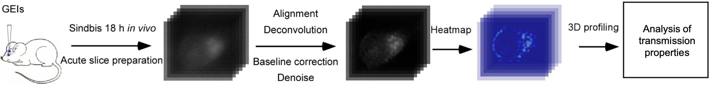

# DecodeNeuroFluo

> **Decoding fluorescence-based neuromodulatory transmission properties** — a MATLAB toolkit for image processing and spatiotemporal analysis of neurotransmission.



<p align="center">
  <a href="#"></a>
  <a href="#"></a>
  <a href="#"></a>
</p>

---


## Table of Contents
- [Features & Methods](#features--methods)
  - [Image Processing](#image-processing)
  - [Spatiotemporal Analysis](#spatiotemporal-analysis)
- [Dependencies](#dependencies)
- [Input & Output Data](#input--output-data)
- [Usage](#usage)
  - [A0 — Quick ΔF/F Test](#a0--quick-Δff-test)
  - [A6_1 — Full Preprocessing (no background adj.)](#a6_1--full-preprocessing-no-background-adj)
  - [A6_2 — Background Adjustment](#a6_2--background-adjustment)
  - [A6_3 — Overlay for Peak Localization](#a6_3--overlay-for-peak-localization)
  - [jerky — 3D Presentation](#jerky--3d-presentation)
  - [A6_4 — Peak Identification (DBSCAN)](#a6_4--peak-identification-dbscan)
  - [A6_5 — Peak Quantification vs Distance](#a6_5--peak-quantification-vs-distance)
- [Notes & Tips](#notes--tips)
- [Citing](#citing)

---

## Features & Methods

### Image Processing
- **Alignment**
- **Deconvolution**
- **Baseline adjustment**
- **Denoise**
- **Background adjustment**
- **ΔF/F presentation**

### Spatiotemporal Analysis
- **Peak location identification**
- **Peak extraction**
- **Peak maximum response analysis**
- **Peak exponential decay analysis**

---

## Dependencies

Add the following **JAR** to MATLAB's Java path (e.g., place in `<MATLABROOT>/java/` or add via `javaaddpath` at startup):

- **DeconvolutionLab_2**

Additional MATLAB Toolboxes required:

- **Curve Fitting Toolbox**
- **Statistics and Machine Learning Toolbox**

> Tip: verify availability in MATLAB with:
>
> ```matlab
> ver('curve_fitting'), ver('statistics_toolbox')
> ```

---

## Input & Output Data

### Input
- Default image format: **`.tif`**
- Images for one cell should reside in the **same folder** named by a number (e.g., `1/`).
- Each image should be **sequentially named**: `1_1.tif`, `1_2.tif`, …

**Example directory**
```
data/
└─ 1/
   ├─ 1_1.tif
   ├─ 1_2.tif
   └─ ...
```

### Output

#### Folders
- `_edited_1/` — aligned images from input  
- `_edited_2/` — deconvolved images from `_edited_1`  
- `_edited_3/` — baseline-adjusted images from `_edited_2`  
- `_edited_4/` — denoised images from `_edited_3`  
- `_edited_5/` — **ΔF/F** calculated from `_edited_4`  
- `_edited_6/` — background-adjusted **ΔF/F** calculated from `_edited_5`  

#### Images
- **Overlaid ΔF/F color image on cell image**: saved in `A6/` as `xx_xxxbmp_transparant.png`
- **3D image**: manually export to **PNG** from MATLAB figure after running `jerky`
- **Peak extraction**: manually export to **PNG** from MATLAB figure after running `jerky`

#### Peak Quantification
- Response vs. distance-to-maximum-response data is saved as **`jacktotal`** (background-adjusted).

---

## Usage

> **Important:** Default frame indices assume a recording long enough to cover `[401, 1001]`. Adjust to your dataset as needed.

### A0 — Quick ΔF/F Test
**Script:** `A0/A0_TestRun.m`

Performs a simple **ΔF/F** calculation and presents results as color images.

Use this to quickly check if responses are visible **without significant movement or noise**.

**Manual options**
- Start & end frames (defaults): `startFrame = 401; endFrame = 1001;` (edit at the top of `A0_TestRun.m`).

---

### A6_1 — Full Preprocessing (no background adj.)
**Script:** `A6/A6_1main.m`

Pipeline: **alignment → deconvolution → baseline adjustment → denoise → ΔF/F (color)**

**Manual options**
- In `STA5Calc.m` **line 40**, set noise level according to setup/image quality to resolve **individual peaks**.
- Start & end frames (defaults) at the top of `A6_1main.m`:
  ```matlab
  startFrame = 401;
  endFrame   = 1001;
  respStart  = 501; % default response onset
  ```

---

### A6_2 — Background Adjustment
**Script:** `A6/A6_2F6.m`

Presents **ΔF/F** after **background adjustment**. By default, background is the **minimum value before response**.

**Manual options**
- **Line 18**: set the background value manually if background is not uniform.

---

### A6_3 — Overlay for Peak Localization
**Script:** `A6/A6_3Overlay.m`

Overlays a chosen **ΔF/F** color image onto a **denoised cell image** for **peak location identification**.

**Manual options**
- Change **slice number** at the beginning of the script.
- **Line 15**: adjust the `bw` range to overlay large responses.

---

### `jerky` — 3D Presentation
**Function:** `jerky`

Generates **3D** visualization of responses. Manually export PNGs from the MATLAB figure.

---

### A6_4 — Peak Identification (DBSCAN)
**Script:** `A6/A6_4PeakIdentification.m`

Identifies clusters of responses using **DBSCAN**. Defaults set for individual peaks with **decay constant ~1**.

**Manual option**
- In `STAPeak.m`, adjust **`epsilon`** and **`minpts`** (line numbers may vary by version) for different cluster sizes.

---

### A6_5 — Peak Quantification vs Distance
**Script:** `A6/A6_5Pumpkintest.m`

Plots **response amplitude** vs **distance to the maximum-response point** for a user-selected peak.
- Requires **circling the region of interest** interactively.
- Output response is background-adjusted (similar to `A6_2F6.m`).

---

## Notes & Tips
- Keep raw and processed data separate (`data/` vs `processed/`) to avoid accidental overwrites.
- Version-control your **manual parameters** (noise level, `epsilon`, `minpts`, frame ranges) by committing small config changes.
- Store exported figures in a `figures/` or `reports/` folder for reproducibility.

---

## Citing
If this toolkit contributes to your work, please cite the publication
